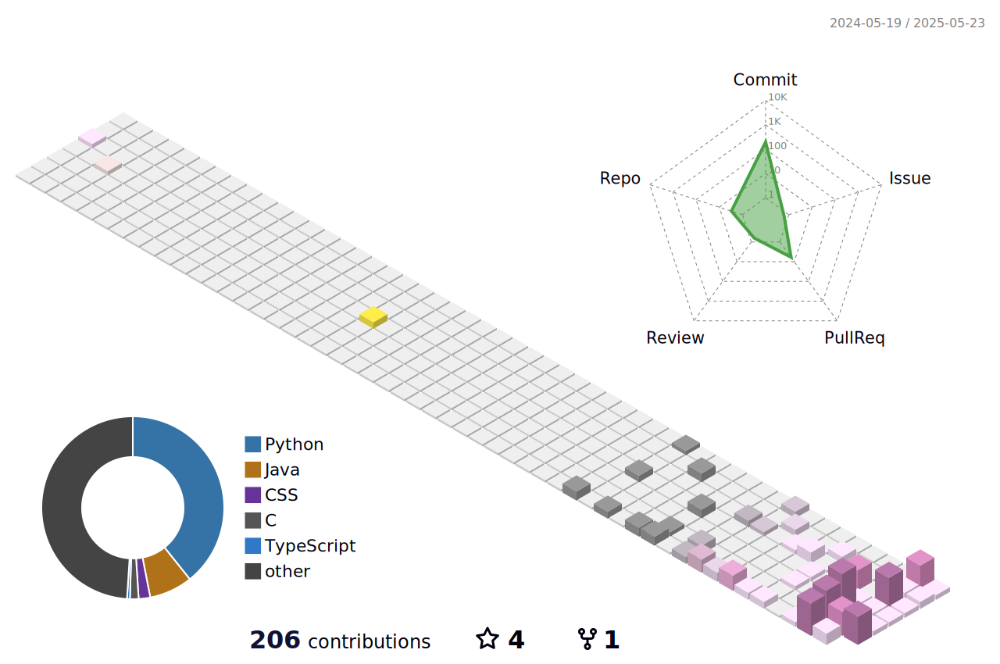

  
  <picture>
    <source
      media="(prefers-color-scheme: dark)"
      srcset="https://typograssy.deno.dev/api?text=Hello%20World!!%20&bg=0d1116&l0=151b23&frame=ffffff&speed=100&comment="
    />
    <source
      media="(prefers-color-scheme: light)"
      srcset="https://typograssy.deno.dev/api?text=Hello%20World!!%20&bg=ffffff&l0=cccccc&frame=000000&speed=100&comment="
    />
    
  </picture>
  
  
I'm Ryo. I'm currently a junior in college. 
I have a strong interest in <strong>competitive programming</strong> and the <strong>visualization, sonification, and haptification of programming</strong>.

  
You are the
    <picture>
    <source
      media="(prefers-color-scheme: dark)"
      srcset="https://komarev.com/ghpvc/?username=ryonakagawa-1012&label=&color=0d1116"
    />
    <source
      media="(prefers-color-scheme: light)"
      srcset="https://komarev.com/ghpvc/?username=ryonakagawa-1012&label=&color=lightgrey"
    />
    
  </picture>
  th visitor.

## My Activity

  <picture>
        <source media="(prefers-color-scheme: dark)"  srcset="output/metrics.base.svg" width="400" />
	<source media="(prefers-color-scheme: light)" srcset="output/metrics.base.svg" width="400" />
	
  </picture>

  <picture>
   	<source media="(prefers-color-scheme: dark)"  srcset="output/details.svg" width="400" />
	<source media="(prefers-color-scheme: light)" srcset="output/details.svg" width="400" />
	
  </picture>
  
  <picture>
	  <source media="(prefers-color-scheme: dark)"  srcset="profile-3d-contrib/profile-night-rainbow.svg" width="700" />
	  <source media="(prefers-color-scheme: light)" srcset="profile-3d-contrib/profile-season-animate.svg" width="700" />
	  
	</picture>

  
  

  <a href="https://atcoder.jp/users/Xx_RYO_xX?contestType=algo">
    <picture>
      <source
        media="(prefers-color-scheme: dark)"
        srcset="https://atcoder-readme-stats.vercel.app/stats/Xx_RYO_xX?theme=darcula&show_icons=true&show_history=5&width=450"
      />
      <source
        media="(prefers-color-scheme: light)"
        srcset="https://atcoder-readme-stats.vercel.app/stats/Xx_RYO_xX?show_icons=true&show_history=5&width=450"
      />
      
    </picture>
  </a>

<!--

  

-->

## My skills, Environments and more

  
  
  
  
  
  
  
  

  
  
  
  
  
  
  
  

  
  
  
  

<picture>
  <source media="(prefers-color-scheme: dark)" srcset="https://raw.githubusercontent.com/ryonakagawa-1012/ryonakagawa-1012/output/github-contribution-grid-snake-dark.svg" />
  <source media="(prefers-color-scheme: light)" srcset="https://raw.githubusercontent.com/ryonakagawa-1012/ryonakagawa-1012/output/github-contribution-grid-snake.svg" />
  
</picture>

## My Portfolio

| 作品名                                                 | 概要               | 使用技術 | 
| ------------------------------------------------------ | ------------------ | -------- | 
| [Othello](https://github.com/ryonakagawa-1012/Othello) | 個人開発 8*8 のオセロゲーム | C | 
|  [Visualization_Sort_Algorithm](https://github.com/ryonakagawa-1012/Visualization_Sort_Algorithm) | 個人開発 様々なソートアルゴリズムをグラフィックライブラリを用いて可視化 | C |
| [sorcery-assemble](https://github.com/c-a-c/sorcery-assemble) | チーム開発 マインクラフトで魔法が使えるアイテムを追加するプラグイン | Java |
| [Competitive-Programming](https://github.com/ryonakagawa-1012/Competitive-Programming) | 競技プログラミングの提出コード、テンプレートなどを保存しているリポジトリ | Python |
| [KSDUPC 2024](https://ioor.connpass.com/event/324201/) | 京都産業大学と同志社大学の有志の学生が運営、作問したプログラミングコンテスト | |
| [TeraCoder2024](https://tcjudge.github.io/teaser-site/2024/) | 所属しているサークルIOORが運営、作問した京都産業大学で行った賞金付きのプログラミングコンテスト | |

## 作問問題一覧

### [KSDUPC 2024](https://ioor.connpass.com/event/324201/)

*   [駅伝中継](https://mofecoder.com/contests/ksdupc_2024/tasks/ksdupc_2024_f)
    *   概要: KSDUPC 2024-F問題、想定解法はSortedlistを使う。優先度付きキューでも回答可能
    *   使用アルゴリズム、データ構造等: Sortedlist, 優先度付きキュー

### [TeraCoder2024](https://tcjudge.github.io/teaser-site/2024/)

*   [Welcome to Teracoder](https://mofecoder.com/contests/teracoder2024/tasks/teracoder2024_a)
    *   概要: TeraCoder2024-A問題、想定解法はfor文等でN回"TeraCoder"を出力する
*   [Only One Canpas](https://mofecoder.com/contests/teracoder2024/tasks/teracoder2024_d)
    *   概要: TeraCoder2024-D問題、想定解法は配列を使って解く
*   [Wreker Terako](https://mofecoder.com/contests/teracoder2024/tasks/teracoder2024_h)
    *   概要: TeraCoder2024-H問題、想定解法は3乗の和の公式を使う
*   [Say!Yes!Kyosan Beam](https://mofecoder.com/contests/teracoder2024/tasks/teracoder2024_k)
    *   概要: TeraCoder2024-K問題、想定解法は強連結成分分解を使う
    *   使用アルゴリズム、データ構造等: 強連結成分分解
*   [Word Chain Terako](https://mofecoder.com/contests/teracoder2024/tasks/teracoder2024_l)
    *   概要: TeraCoder2024-L問題、想定解法は問題文通りに実装する
